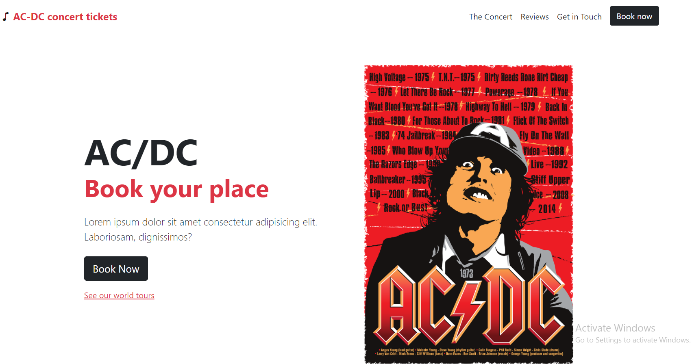
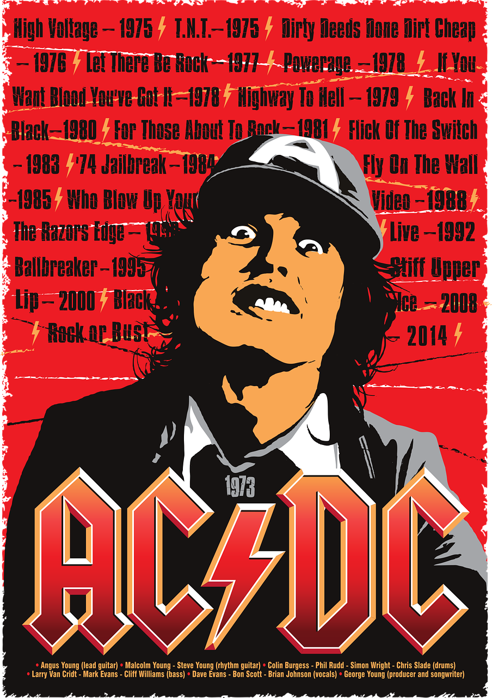

# Bootstrap5 Project

This is the Boostrap5 project[Bootstrap5 project](https://ac-dc-tickets.netlify.app/). 

## Table of contents

- [Overview](#overview)
  - [Screenshot](#screenshot)
  - [Links](#links)
- [My process](#my-process)
  - [Built with](#built-with)
  - [What I learned](#what-i-learned)
  - [Continued development](#continued-development)
  - [Useful resources](#useful-resources)
- [Author](#author)


## Overview

Built  with and HTML and Bootstrap5. This project is based on practicing Bootstrap5 with different elements from their website, and a little interactivity with JavaScript.

### Screenshot




### Links

- Solution URL: [https://github.com/Holllyyyy/bootstrap5-ac-dc-tickets](https://github.com/Holllyyyy/bootstrap5-ac-dc-tickets)
- Live Site URL: [https://ac-dc-tickets.netlify.app/](https://ac-dc-tickets.netlify.app/)

## My process

I started with writing HTML5, where I added different stylesheets to my HTML. Some parts on the head and for JavaScript are on the bottom. So that links will provide all work on this html. 

```html
<link href="https://cdn.jsdelivr.net/npm/bootstrap@5.0.1/dist/css/bootstrap.min.css" rel="stylesheet"
    integrity="sha384-+0n0xVW2eSR5OomGNYDnhzAbDsOXxcvSN1TPprVMTNDbiYZCxYbOOl7+AMvyTG2x" crossorigin="anonymous" />
  <link rel="stylesheet" href="https://cdn.jsdelivr.net/npm/bootstrap-icons@1.8.1/font/bootstrap-icons.css">
  <style>

```
This stylesheet I linked to my HTML file, one for bootstrap to be connected and another for icons. This is on my head.
```html
  <script src="https://cdn.jsdelivr.net/npm/bootstrap@5.0.1/dist/js/bootstrap.bundle.min.js"
    integrity="sha384-gtEjrD/SeCtmISkJkNUaaKMoLD0//ElJ19smozuHV6z3Iehds+3Ulb9Bn9Plx0x4"
    crossorigin="anonymous"></script>
  <script>
    const tooltips = document.querySelectorAll('.tt')
    tooltips.forEach(t => {
      new bootstrap.Tooltip(t)
    })
  </script>
```
This is on the bottom of my HTML file, where first is linked for bootstrap to work , and second is interactivity with JavaScript ,for my tooltips to be activated.
```html
  <!-- navbar -->
  <nav class="navbar navbar-expand-md navbar-light pt-3 pb-3">
    <div class="container-xxl">
      <!-- navbar brand / title -->
      <a class="navbar-brand" href="#intro">
        <i class="bi bi-music-note"></i>
        <span class="text-danger fw-bold"> AC-DC concert tickets </span>
      </a>
      <!-- toggle button for mobile nav -->
      <button class="navbar-toggler" type="button" data-bs-toggle="collapse" data-bs-target="#main-nav"
        aria-controls="main-nav" aria-expanded="false" aria-label="Toggle navigation">
        <span class="navbar-toggler-icon"></span>
      </button>
```
The very beggining of project started with navigation and navbar. Theres also  toggle button for mobile nav. All of this classes can be found on bootstrap official site. padding top and bottom i used "pt pb" also we can use" py" for both. Container xxl, means for large screen will be applied. Because after is diffrent look for mobile view. Font-weight, text-color,background are just some of things i used here. 

```html

<!-- navbar links -->
      <div class="collapse navbar-collapse justify-content-end align-center" id="main-nav">
        <ul class="navbar-nav">
          <li class="nav-item">
          </li>
          <li class="nav-item d-md-none">
            <a class="nav-link text-dark" href="#pricing">Pricing</a>
          </li>
          <li class="nav-item ms-2 d-none d-md-inline">
            <a class="btn btn-dark" href="#pricing">Book now</a>
          </li>
     
```

Justify-end so will move links to the right side,and align-center, so will be center verticaly. d-md-none  is display-none for medium sizes and wheres just d-none means it wont show up untill d-md-inline what is display on the medium size to be inline.

```html
<!-- intro text -->
<div class="col-md-5 text-center text-md-start">
          <h1>
            <div class="display-2 fw-bold">AC/DC</div>
           <!-- main image & -->
             <div class="col-md-4 text-center d-none d-md-block">
          <span class="tt" data-bs-placement="bottom" title="AC/DC poster">
            

```
Here at the first is just how i want my text to look, so by defaul all starting with mobile view, so here col-md-5 is what will be applied for medium size n more.  Because on small sizes will be centered and will take 12 col.

Picture wont show up on small devices, so d-none is doing it, and later d-md-block, means it will show up on medium n larger screens. 
```html
<!--tickets-->
div class="row my-5 g-0 align-items-center justify-content-center">
        <div class="col-8 col-lg-4 col-xl-3">
          <div class="card border-0">
            <div class="card-body text-center py-4">
              <h4 class="card-title">Tribune</h4>
              <p class="lead card-subtitle">Credit cards only</p>

```
This is my three cards, tickets, where for grid I have col 8 so will be free 2 col left and 2 right than I have col-lg-4 what means on larger devices it will take space of 4 and leave space for 8 more col.but for small devices will be only one. 
```html
<div class="accordion" id="history">
            <div class="accordion-item">
              <h2 class="accordion-header " id="heading-1">
                <button class="accordion-button bg-light" type="button" data-bs-toggle="collapse"
                  data-bs-target="#story" aria-expanded="true" aria-controls="story">
                  How all started?
                </button>
                 </h2>
              <div id="story" class="accordion-collapse collapse show" aria-labelledby="heading-1"
                data-bs-parent="#history">
                <div class="accordion-body">
                  <p>
                    Lorem ipsum dolor sit amet consectetur adipisicing elit. A maiores
                    laboriosam officia tenetur autem amet, quibusdam aspernatur qui,
                    veniam adipisci debitis est perferendis eaque ipsum, dolores
                    minima? Quas, repudiandae iusto.
                  </p>
                </div>
              </div>
            </div>
```
Use of accordion here from bootstrap official page, where I put class of accordion and my id history, accordation item header, n my id heading 1. For button I used my id  story for data-bs-target, and for aria-controls-story so all will be connected. After it in accordion body i connected again history id and in my div id story so all be connected and  work well.  Ive got lost few times with a lot of closing tags for div, so I needed to count , because this is the first time I wrote something like this.
```html
 <div class="list-group">
            <div class="list-group-item py-3">
```
This is just for list group  and items for fan reviews, where i added icons from bootstrap icons, for larger screen to be col-lg-8. and some divs,h5,and p. 
something like this.
```html
 <section class="" id="contact">
    <div class="container-lg">

      <div class="text-center">
        <h2 class="text-danger">Subscribe</h2>
        <p class="lead text-dark">Have some question, or any wish ? Feel free to contact us...</p>
      </div>

      <div class="row justify-content-center my-5">
        <div class="col-lg-6">
          <form>
            <label for="email" class="form-label">Your email:</label>
            <div class=" mb-4 input-group">
              <span class="input-group-text">
                <i class="bi bi-envelope-heart-fill"></i>
              </span>

              <input type="email" class="form-control" id="email" placeholder=" name@gmail.com">
              <span class="input-group-text">
                <span class="tt" data-bs-placement="bottom" title="Enter an email address we can reply to.">
                  <i class="bi bi-question-circle text-muted"></i>
                </span>
              </span>
            </div>

            <label for="name" class="form-label">Your name:</label>
            <div class=" mb-4 input-group">
              <span class="input-group-text">
                <i class="bi bi-person-hearts"></i>
              </span>
              <input type="text" class="form-control" id="name" placeholder=" your name">
              <span class="input-group-text">
                <span class="tt" data-bs-placement="bottom" title="Enter your name.">
                  <i class="bi bi-question-circle text-muted"></i>
                </span>
              </span>
            </div>
            <label for="subject" class="form-label">What is your question/wish?</label>
            <div class=" mb-4 input-group">
              <span class="input-group-text">
                <i class="bi bi-card-heading"></i>
              </span>
              <select class="form-select" id="subject">
                <option value="tickets-tribune">Tickets Tribune</option>
                <option value="tickets-fun-pit">Tickets Fun Pit</option>
                <option value="tickets-ground-floor">Tickets Ground Floor</option>
              </select>
            </div>
            <div class="mb-4 mt-5 form-floating">

              <textarea class="form-control" id="query" style="height: 140px" placeholder="query"></textarea>
              <label for="query">Your question...</label>
            </div>
            <div class="mb-4 text-center">
              <button type="submit" class="btn btn-danger">Submit</button>
            </div>
          </form>
```
Here I created contact form, where is inside form to write email,name and some text.  Also here I put some icons inside it.And what is importan to put icon after label if we want to place it at the start and if we want to place it at the end than we need to place icon after input. What I used after input is icons but also title where we can add more description n moment user hover there. 

Also I used modal, what is on the bottom of the page,where when we click it will open small window, and we can write our email. All what is need to use is modal in classes with title content dialog and so on, 
Use of offcanvas at the beggining where just needed to add how i want to be show to put part where I want that to b and than later on bottom of html to write rest , like div of offcanvas body and some paragraph ,button and so on. Inside it there also added dropdown manu.


### Built with :

- Semantic HTML5 markup
- Bootstrap5
- JavaScript
- Mobile-first workflow

### What I learned

While working on this project I learned how to use Bootstrap5. How to use it in my HTML5 file, how to merge it, and use knowledge of CSS by writing all with classes and Bootstrap5. Also how to connect JavaScript with it as well. 

### Continued development

I want to practice more Bootstrap5, also what I want to do, to download it locally and to customize it, by using SCSS, and add more colors on my page,for the next project I will work on. 

### Useful resources

- [Conquering Responsive Layouts](https://courses.kevinpowell.co/view/courses/conquering-responsive-layouts) - This helped me for responsive design. I really liked this pattern and will use it going forward.
- [Responsive Web Design: Using Fonts Responsively](https://www.sitepoint.com/understanding-responsive-web-design-how-to-manage-fonts/) - This is an amazing article which helped me finally understand more about how to use fonts responsively. I'd recommend it to anyone still learning this concept.
- [Net-Ninja](https://www.youtube.com/watch?v=O_9u1P5YjVc&list=PLbVaR4VxGchAyu_UOh5CmH7ySwkV1w4l8&ab_channel=TheNetNinja) - This is an amazing crash course which helped me finally understand more about how to use Bootstrap. I'd recommend it to anyone still learning this concept.

## Author

- Website - [Svetlana Jokic](https://my-portfolio-hollyy.netlify.app/)
- Frontend Mentor - [@Holllyyyy](https://www.frontendmentor.io/profile/Holllyyyy)
- Twitter - [@svetlanajokic](https://twitter.com/svetlanajokic)
  -LinkedIn - [@Svetlana Jokic](https://www.linkedin.com/in/svetlana-jokic-787432100/)
